## EXPERIMENTATION RESULTS

### SETUP

A 2016 HP Pavillion laptop with Intel Core i7-7500U (2 cores, hyperthreaded), 16 GB of RAM and an M.2 SSD. Used to save passively cooled MacBook Air from overheating. Performance likely similar to a modern entry-level laptop.

Tree ensemble model used: EvoTrees.jl, an implementation of gradient boosted trees. Gurobi used for optimization and JuMP for MIP formulation.

### 1. MODEL QUALITY

#### R SQUARED SCORES

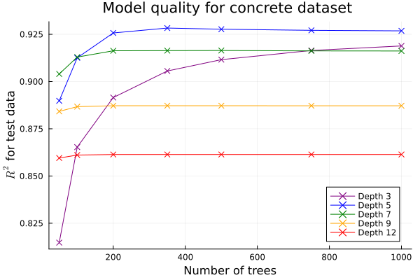

For the concrete dataset, depth of 5 was seen to perform the best. No improvement was seen beyond 200 trees.

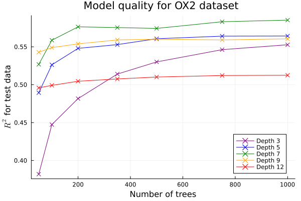

With the higher-dimensional OX2 dataset, best results were seen with depth 7. Again, increasing the forest size beyond 200 did not improve the model.

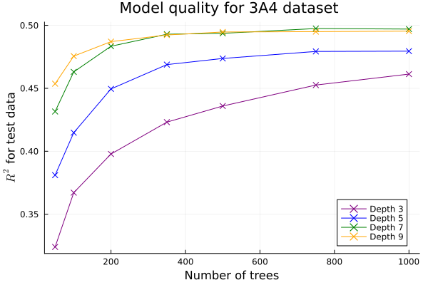

The largest 3A4 dataset was too computationally intensive for training a forest with depth 12. Still, even with this dataset, a depth of 9 did not perform better than a depth of 7. Here the model improvement plateaued at 350 trees.

#### TRAINING TIME

| 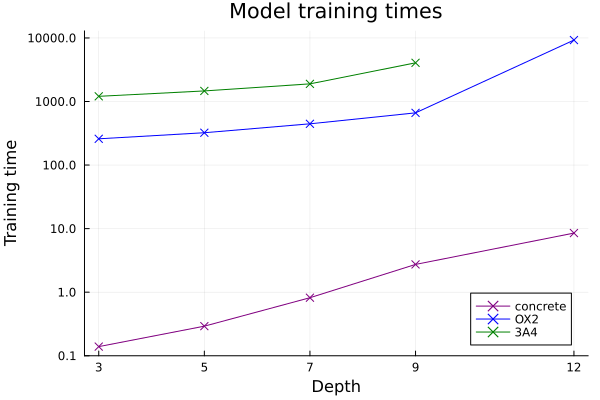 |
| :--: |
| *All training times are for a model with 1000 trees, depth as specified, and other parameters at their default values.* |

The training times for the concrete dataset were modest at less than ten seconds.

The molecule datasets were considerably slower due to their size with training from multiple minutes to multiple hours. 3A4 dataset was not able to be trained with depth 12 due to crashing.

Growth of the training times was exponential with increasing depth.

#### SUMMARY

Depths of 5-7 seem to perform the best, even with high-dimensional large datasets. Forest sizes beyond 200-350 did not improve the model.

The competition held with the molecule datasets in 2014 had a winning R squared score of 0.5. Our results are very close, demonstrating the predictive power of gradient boosted trees, even with modest model sizes.

Training times are very fast for small datasets but increase exponentially with model and dataset size.

### 2. OPTIMIZATION PERFORMANCE

#### CONCRETE DATASET

| 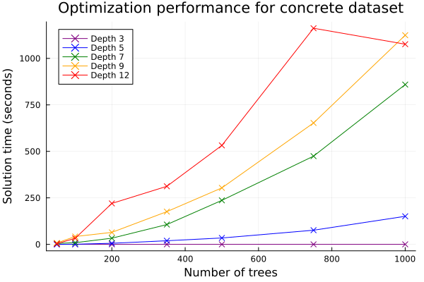 |
| :--: |
| *Solution times for the optimization problem, without split constraint generation.*|

| 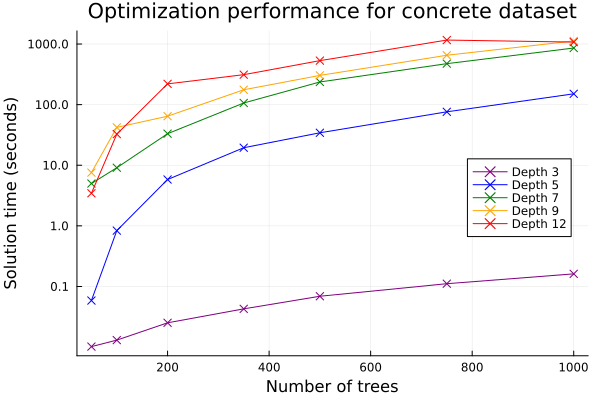  |
| :--: |
| *Same graph with logarithmic scaling.*|

The growth of the solution times with the number of trees is exponential.

|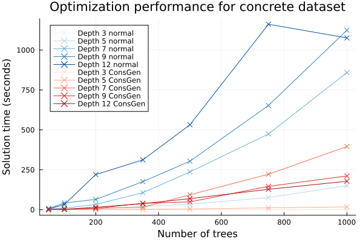|
| :--: |
| *Solution times with the constaint generation algorithm added.*|

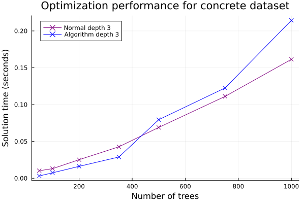

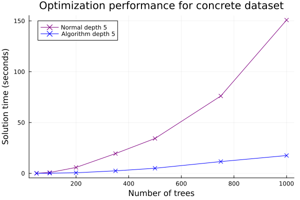

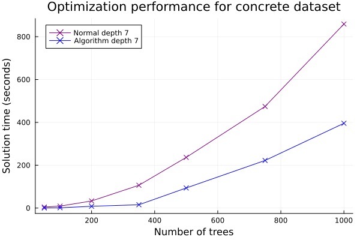

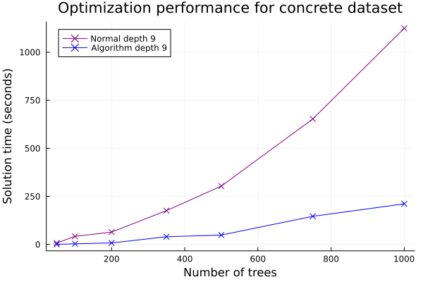

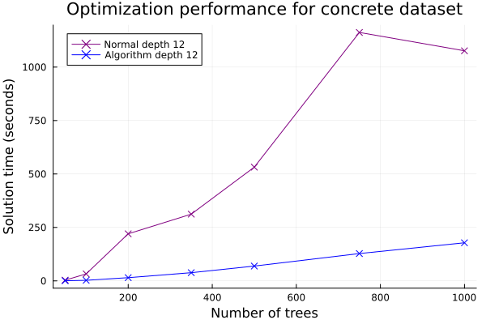

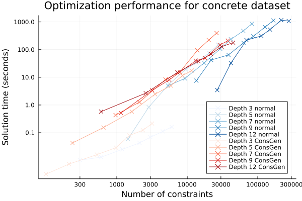

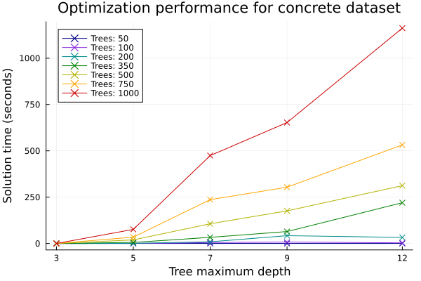

#### CONCLUSIONS

The optimization problem difficulty scales exponentially with forest size and (maybe) linearly with maximum tree depth. 

The split constraint algorithm provides a significant improvement in solution times.

Optimizing a well performing model (established to have a depth of 5 and a forest size of 200) is very easy even for an old laptop, with solution time times being a few seconds.

